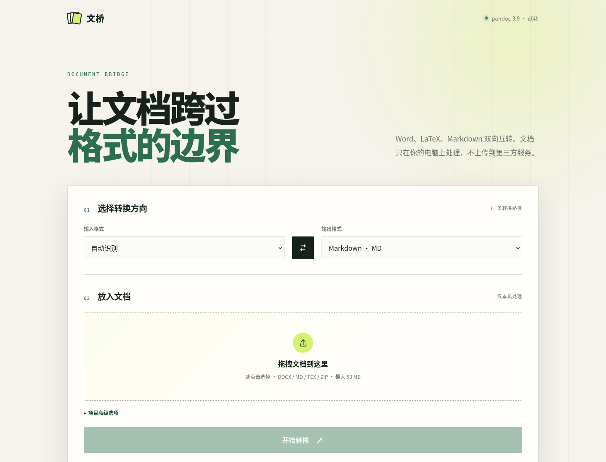

<p align="center">
  
</p>

<h1 align="center">文桥 · Document Bridge</h1>

<p align="center">
  <strong>Word、LaTeX、Markdown，本地双向互转。</strong><br>
  不上传第三方，不绑定云服务，让文档跨过格式的边界。
</p>

<p align="center">
  <a href="https://github.com/KarlHeinrich-jpg/document-bridge/releases/latest"></a>
  <a href="https://github.com/KarlHeinrich-jpg/document-bridge/actions/workflows/test.yml"></a>
  <a href="LICENSE"></a>
  
</p>

<p align="center">
  <a href="#-直接下载">直接下载</a> ·
  <a href="#-它能做什么">功能</a> ·
  <a href="#-使用方法">使用方法</a> ·
  <a href="#-项目-zip">项目 ZIP</a> ·
  <a href="#-命令行与-api">CLI / API</a> ·
  <a href="#-常见问题">常见问题</a>
</p>



> [!NOTE]
> Document Bridge is a local-first bidirectional converter for Word (`.docx`), LaTeX (`.tex`) and Markdown (`.md`). The interface and documentation are primarily in Chinese, while filenames and APIs remain language-neutral.

## ⬇️ 直接下载

前往 [最新 Release](https://github.com/KarlHeinrich-jpg/document-bridge/releases/latest)，下载与你的系统对应的免安装包：

| 系统 | 下载 | 启动方式 |
|---|---|---|
| Windows 10/11 x64 | [DocumentBridge-windows-x86_64.zip](https://github.com/KarlHeinrich-jpg/document-bridge/releases/latest/download/DocumentBridge-windows-x86_64.zip) | 解压后双击 `DocumentBridge.exe` |
| macOS Apple Silicon | [DocumentBridge-macos-arm64.tar.gz](https://github.com/KarlHeinrich-jpg/document-bridge/releases/latest/download/DocumentBridge-macos-arm64.tar.gz) | 解压后运行 `DocumentBridge` |
| Linux x86_64 | [DocumentBridge-linux-x86_64.tar.gz](https://github.com/KarlHeinrich-jpg/document-bridge/releases/latest/download/DocumentBridge-linux-x86_64.tar.gz) | 解压后运行 `./DocumentBridge` |

免安装包已经包含 Python 运行时与 Pandoc，不需要另装依赖。程序启动后会自动打开浏览器；文档仍然只在本机转换。

<details>
<summary><strong>macOS 或 Windows 阻止首次运行怎么办？</strong></summary>

目前发布包没有商业代码签名。macOS 可能提示无法验证开发者，可在“系统设置 → 隐私与安全性”中确认打开；Windows SmartScreen 可能需要选择“更多信息 → 仍要运行”。你也可以使用下面的源码启动方式，所有构建配置都在仓库中公开。

</details>

### 从源码一键启动

需要 Python 3.10 或更高版本，首次启动需要联网下载依赖：

```bash
git clone https://github.com/KarlHeinrich-jpg/document-bridge.git
cd document-bridge
```

- Windows：双击 `start.bat`
- macOS：双击 `start.command`
- Linux：运行 `./start.sh`

脚本会自动创建隔离的 `.venv`、安装带 Pandoc 的运行环境并打开网页。后续启动不会重复安装。

## ✨ 它能做什么

文桥覆盖三种格式之间的全部六条转换路径：

| 输入 | 输出 Word | 输出 LaTeX | 输出 Markdown |
|---|:---:|:---:|:---:|
| Word `.docx` | — | ✅ | ✅ |
| LaTeX `.tex` / 项目 ZIP | ✅ | — | ✅ |
| Markdown `.md` / 项目 ZIP | ✅ | ✅ | — |

核心能力：

- **结构优先**：迁移标题、段落、粗斜体、列表、引用、链接、脚注和常见表格；
- **公式友好**：在 Word 公式、LaTeX 数学语法和 Markdown 数学块之间转换；
- **资源随行**：Word 转文本格式时自动提取图片，正文与资源一起打成 ZIP；
- **项目感知**：支持带图片、参考文献与子目录的 LaTeX / Markdown 项目 ZIP；
- **主文档识别**：自动识别 `main.tex`、`index.md` 等入口，也允许手动指定；
- **三种入口**：拖拽网页、命令行和 HTTP API 使用同一个转换核心；
- **本地优先**：默认仅监听 `127.0.0.1`，不把文件传给任何第三方服务。

### 保真度参考

格式转换更像“翻译”，不是像素级复刻。三种格式的表达能力不同：

| 内容 | 通常效果 | 说明 |
|---|---|---|
| 标题、段落、粗体、斜体 | 很好 | 三种格式都有直接对应结构 |
| 列表、引用、链接、脚注 | 很好 | 少数嵌套样式可能简化 |
| 行内公式、独立公式 | 较好 | 自定义宏需要手工检查 |
| 图片 | 较好 | 文本输出会连同资源打包 |
| 普通表格 | 较好 | 合并单元格和复杂边框可能简化 |
| 参考文献 | 视项目而定 | 建议把 `.bib`、CSL 一并放入 ZIP |
| 页眉页脚、分页、浮动位置 | 有损 | Markdown 不表达精确页面布局 |
| 文本框、SmartArt、宏、修订记录 | 不保证 | 建议保留原始 Word 文档 |
| 自定义 LaTeX 命令与宏包 | 不保证 | Pandoc 无法理解任意用户宏 |

## 🚀 使用方法

### 1. 选择转换方向

输入格式可以自动识别，也可以手动选择 Word、LaTeX 或 Markdown。输出格式不能与输入相同。

### 2. 放入文档

拖入 `.docx`、`.md`、`.tex` 或 `.zip`，单个网页上传文件最大 50 MB。

### 3. 下载结果

- 输出 Word 时，下载一个 `.docx`；
- 输出 LaTeX / Markdown 且没有资源时，下载一个 `.tex` / `.md`；
- Word 中包含图片或输入为项目 ZIP 时，下载正文与资源组成的 ZIP。

服务启动后，还可以访问 [http://127.0.0.1:8765/api/docs](http://127.0.0.1:8765/api/docs) 查看交互式 API 文档。

## 📦 项目 ZIP

当 LaTeX 或 Markdown 引用了图片、`.bib`、CSL 或其他文件时，请保持相对路径，把完整项目压缩后上传：

```text
paper.zip
└── paper/
    ├── main.tex            ← 主文档
    ├── references.bib
    ├── figures/
    │   ├── model.png
    │   └── results.pdf
    └── sections/
        └── method.tex
```

工具会优先识别以下名字：

- LaTeX：`main.tex`、`index.tex`、`document.tex`；
- Markdown：`index.md`、`README.md`、`main.md`；
- 若仍有多个候选文件，会结合 `\documentclass`、标题和目录深度选择，并返回提示；
- 也可以在“项目高级选项”中填写 `paper/main.tex` 这样的相对路径。

转换后的主文档会放回对应目录，原项目资源会保留在结果 ZIP 中。

## ⌨️ 命令行与 API

### 安装为命令

```bash
python -m pip install .

# 启动网页
document-bridge

# 查看命令行转换帮助
document-bridge-cli --help
```

### 命令行示例

```bash
# Word → Markdown
document-bridge-cli report.docx --to markdown

# Markdown → Word，并指定输出路径
document-bridge-cli paper.md --to docx -o paper.docx

# LaTeX 项目 → Markdown，指定 ZIP 内的入口
document-bridge-cli project.zip \
  --from latex \
  --to markdown \
  --main-file paper/main.tex
```

如果没有使用 `-o`，结果写入当前目录。包含资源的文本输出会自动使用 ZIP。

### HTTP API 示例

```bash
curl -X POST http://127.0.0.1:8765/api/convert \
  -F "file=@paper.docx" \
  -F "source_format=auto" \
  -F "target_format=latex" \
  --output paper-to-latex.zip
```

接口字段：

| 字段 | 必填 | 可选值 / 说明 |
|---|:---:|---|
| `file` | 是 | 文档或项目 ZIP |
| `source_format` | 否 | `auto`、`docx`、`markdown`、`latex` |
| `target_format` | 是 | `docx`、`markdown`、`latex` |
| `main_file` | 否 | ZIP 内主文档的相对路径 |

Pandoc 的非致命警告会以 JSON 数组写入 `X-Document-Bridge-Warnings` 响应头。

## 🧱 工作原理

```text
浏览器 / CLI / API
        │
        ▼
格式识别与 ZIP 安全解包
        │
        ▼
Pandoc 文档语法树转换
        │
        ├── 输出 DOCX：嵌入可解析资源
        └── 输出 MD/TEX：提取或保留资源并按需打包 ZIP
        │
        ▼
临时目录清理与结果下载
```

主要目录：

```text
app/
├── core.py          # 转换、格式识别、ZIP 安全与资源打包
├── main.py          # FastAPI 服务
├── launcher.py      # 自动打开浏览器的一键启动器
├── cli.py           # 命令行入口
└── static/          # 无前端框架的本地网页
tests/
├── test_core.py     # 安全与格式识别单元测试
└── integration_smoke.py  # 六路径、图片和项目 ZIP 集成测试
```

## 🔒 隐私与安全

- 默认仅监听本机回环地址 `127.0.0.1`；
- 不接入分析 SDK，不加载远程字体，不上传转换内容；
- 上传内容在系统临时目录中处理，响应结束后清理；
- ZIP 最多 1,000 个条目，解压后最多 100 MB；
- 拒绝绝对路径、`..` 路径穿越和符号链接；
- 单次 Pandoc 转换超时为 120 秒。

请不要把本服务直接暴露到公共互联网。更多信息见 [SECURITY.md](SECURITY.md)。

## 🧪 开发与测试

```bash
git clone https://github.com/KarlHeinrich-jpg/document-bridge.git
cd document-bridge
python -m venv .venv

# Linux / macOS
.venv/bin/python -m pip install -r requirements-dev.txt
.venv/bin/python -m unittest discover -s tests -v
.venv/bin/python -m tests.integration_smoke

# 构建当前系统的免安装目录
.venv/bin/pyinstaller --noconfirm --clean DocumentBridge.spec
dist/DocumentBridge/DocumentBridge --version
```

集成测试会实际验证：

1. Word → Markdown；
2. Word → LaTeX；
3. Markdown → Word；
4. Markdown → LaTeX；
5. LaTeX → Word；
6. LaTeX → Markdown；
7. Word 图片提取与 ZIP 打包；
8. LaTeX 项目资源保留与 ZIP 打包。

GitHub Actions 会在 Linux 上运行 Python 3.10、3.12、3.14 测试。推送 `v*` 标签后，会分别在 Windows、macOS 和 Linux 原生环境构建 Release 包；PyInstaller 不是交叉编译器，因此三个系统必须分开构建。

## ❓ 常见问题

<details>
<summary><strong>为什么结果和原文档排版不完全一样？</strong></summary>

Word 面向页面排版，LaTeX 面向排版指令，Markdown 面向轻量结构。标题和公式能迁移，但精确分页、浮动位置、字体和文本框没有一一对应关系。建议把结果当作高质量可编辑迁移稿，并永久保留源文件。

</details>

<details>
<summary><strong>为什么下载的是 ZIP，不是 MD 或 TEX？</strong></summary>

因为正文引用了图片或项目资源。只下载文本文件会造成图片丢失，因此文桥把正文与 `assets/` 一起打包。

</details>

<details>
<summary><strong>支持旧版 .doc 吗？</strong></summary>

当前直接支持 `.docx`。可以先用 Word 或 LibreOffice 把 `.doc` 另存为 `.docx`，再交给文桥转换。

</details>

<details>
<summary><strong>能转换 PDF 吗？</strong></summary>

当前不支持。PDF 是最终页面描述格式，恢复成结构化 Word / LaTeX / Markdown 需要 OCR 和版面分析，是不同类型的任务。

</details>

<details>
<summary><strong>可以批量转换吗？</strong></summary>

网页目前一次处理一个文档。命令行可以配合 Shell、PowerShell 或 Python 循环批量调用 `document-bridge-cli`。

</details>

## 🗺️ 后续方向

- [ ] 自定义 Word 参考模板 `reference.docx`；
- [ ] CSL 样式与参考文献选项；
- [ ] 网页端批量转换队列；
- [ ] 转换前结构预览与警告报告；
- [ ] 可选的 PDF 输出链路；
- [ ] 更多界面语言。

欢迎提交 [Issue](https://github.com/KarlHeinrich-jpg/document-bridge/issues) 或 Pull Request。若报告转换问题，请尽量提供不含隐私内容的最小复现文档。

## 📄 许可证与致谢

文桥以 [MIT License](LICENSE) 发布。

转换核心由 [Pandoc](https://pandoc.org/) 驱动；网页服务使用 [FastAPI](https://fastapi.tiangolo.com/)；免安装包使用 [PyInstaller](https://pyinstaller.org/) 构建。各依赖继续遵循其各自许可证。

---

<p align="center">
  <sub>Document Bridge · Local first · Built for documents that need to travel</sub>
</p>
